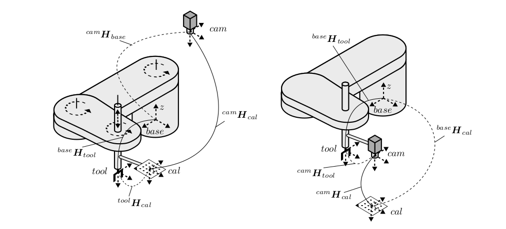

# handeye-4dof: Handeye Calibration for 4DOF Manipulators

<p align="center">

<br>
<em> Figure 1. Handeye calibration for 4DOF SCARA arms [1]. Left is eye-on-base and right is eye-on-hand. </em>
</p>

This package provides eye-on-hand handeye calibration for 4DOF robot manipulators using dual quaternions. This is an implementation of [1] which extended dual quaternion handeye calibration techniques [2] to 4DOF robots. Handeye calibration through dual quaternions is favorable as it allows for us to solve for translation and rotation simultaneously, thus avoiding any compounding error resultant from solving these separately.
## Background

Robot handeye calibration is an important and well studied problem that allows us to obtain the unknown static transformation between the end effector and camera (*in eye-on-hand case*) or the robot base and camera (*in eye-on-base case*). This is done by sampling several transformations between the base and end effector (*through forward kinematics*) and camera to marker (*through marker detection methods*) which allows us to formulate the [**AX = XB**](https://en.wikipedia.org/wiki/Hand_eye_calibration_problem) problem where **X** is our unknown desired static transform.

Several methods exist to solve for **X** but a vast majority of these methods assume that the robot is well articulated (i.e. has 6DOF). For 4DOF robots such as SCARAs (x, y, z, yaw), conventional calibration methods are infeasible and are incapable of producing valid results. This method circumvents this problem by reducing [2] to 4DOF robots. See [1] for further details. For an introduction to dual quaternions, see [3].

## How to run
To run, first install necessary packages.
```bash
python3 -m pip install -r requirements.txt
```
The expected format for poses is a pickle file containing a tuple consisting of a list of base to hand transforms and a list of camera to marker transforms. All transforms should be 4x4 numpy arrays.

Afterwards, calibration can be performed by running the command shown below. 

```bash
cd src # For descriptions on the command line arguments, run python3 calibrate.py -h
python3 calibrate.py [-h] [-p POSE_PATH] [-m MOTION_PATH] [-c] [-a] [-n] [-s SAMPLE]
```

For those who wish to create their own custom scripts, an example template is provided in `src/example.py` *(small snippet shown below)*. Running these examples will also perform the calibration on the provided example data.
```python3
def main():
    with open("../example_data/pose_samples.pkl", "rb") as f:
        try:
            base_to_hand, camera_to_marker = pickle.load(f)
        except UnicodeDecodeError:
            # python 2 to python 3 pickle in case sampling was done in ROS
            base_to_hand, camera_to_marker = pickle.load(f, encoding='latin1')

    # Obtain optimal motions as dual quaternions.
    motions = robot_pose_selector(camera_to_marker, base_to_hand)

    # Initialize calibrator with precomputed motions.
    cb = Calibrator4DOF(motions)

    # Our camera and end effector z-axes are antiparallel so we apply a 180deg x-axis rotation.
    dq_x = cb.calibrate(antiparallel_screw_axes=True)

    # Hand to Camera TF obtained from handeye calibration.
    ca_hand_to_camera = np.linalg.inv(dq_x.as_transform())

    # Hand to Camera TF obtained from post nonlinear refinement.
    nl_hand_to_camera = cb.nonlinear_refinement(base_to_hand, camera_to_marker, ca_hand_to_camera)
  ```

## TODO
- Improve README documentation.
- Add ROS capabilities.
- ~~Add command line interface.~~
- ~~Add post nonlinear refinement.~~
- Add singular value checking.
- Add pose selection based off of dual quaternion scalar score *(tried but not working)*.
- Add eye-on-base functionality **(major update)**.
- Add details for z-translation obtainment.
- Add code comments throughout.

## References
[1] Ulrich, Markus. “Hand-Eye Calibration of SCARA Robots.” (2014).

[2] Daniilidis, Kostas. “Hand-Eye Calibration Using Dual Quaternions.” The International Journal of Robotics Research 18 (1999): 286 - 298.

### Dual Quaternion Guide
[3] Kenwright, Ben. “A Beginners Guide to Dual-Quaternions: What They Are, How They Work, and How to Use Them for 3D Character Hierarchies.” WSCG 2012 (2012).


